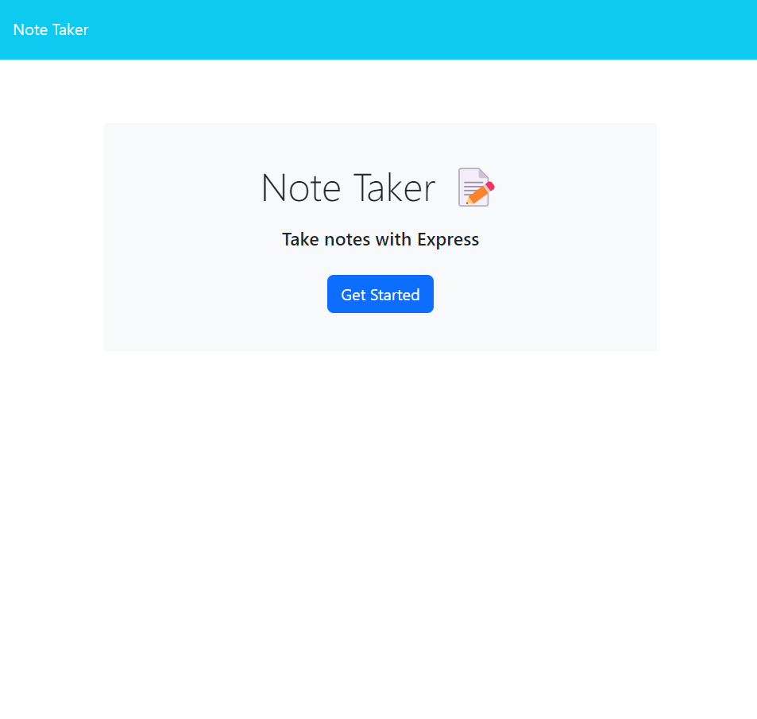
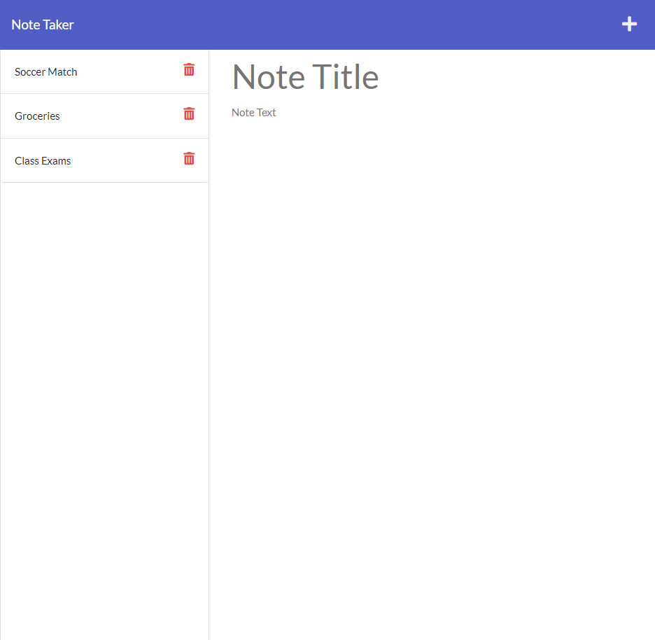

# Install

Clone project and run the following line of code in your terminal to install 
all packages

# Note Taker
An application to write and save note with Express.js back end and will save and retrieve note data from JSON file. The Application will be deployed in Heroku

## Git Hub URL

https://github.com/Tocopro/Project11Deploy

## Technologies Use

<a href="https://nodejs.org/">Node.js</a>

<a href="https://www.npmjs.com/">NPM</a>

<a href="https://www.npmjs.com/package/express">Express.js</a>

<a href="https://www.npmjs.com/package/inquirer">Inquirer.js</a>

<a href="https://www.npmjs.com/package/uuid">uuid</a>

<a href="https://getbootstrap.com/">Bootstrap</a>

<a href="https://fonts.google.com/">Google Fonts</a>

## Description
An application to write and save note with Express.js back end and will save and retrieve note data from JSON file.

## Usage
- The application will allow user to be able to add note's title and description
- The application will allow user to be able to save the notes and won't lose them even they refresh the page
- Application will allow user to be delete notes

## Screenshots

## Usage Demonstration Video

## Credits
W3schools Express, Node JS 
GeeksforGeeks Express, Node JS, Git

## Contributor:
Nicholas Wachira nicwac200g@gmail.com

